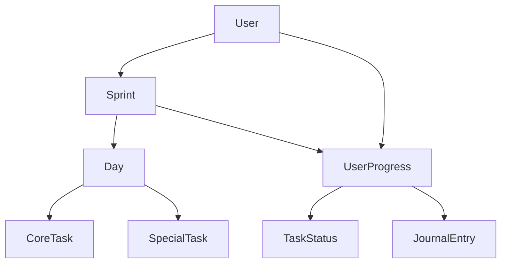

# 🏗️ Technical Architecture Documentation

## System Overview

The Elevatr Career Success Tracker is a Next.js-based web application designed to help users manage their career development through structured sprint methodology. The application provides task management, progress tracking, and analytics features.

## Technology Stack

### Frontend
- **Framework**: Next.js 15.3.3 with App Router
- **Language**: TypeScript
- **Styling**: Tailwind CSS
- **UI Components**: Custom component library
- **State Management**: React Context API

### Backend & Database
- **Database**: Firebase Firestore
- **Authentication**: Firebase Auth
- **Hosting**: Vercel (recommended)
- **File Storage**: Firebase Storage

### Development Tools
- **Package Manager**: npm
- **Linting**: ESLint
- **Type Checking**: TypeScript
- **Build Tool**: Turbopack (Next.js)

## Project Structure

```
src/
├── app/                    # Next.js App Router pages
│   ├── layout.tsx         # Root layout component
│   ├── page.tsx          # Home dashboard page
│   ├── calendar/         # Calendar view page
│   ├── journal/          # Journal entry pages
│   ├── progress/         # Analytics and progress pages
│   ├── settings/         # User settings pages
│   ├── sprint/           # Sprint management pages
│   └── tasks/            # Task management pages
├── components/           # Reusable UI components
│   ├── auth/            # Authentication components
│   ├── dashboard/       # Dashboard-specific components
│   ├── layout/          # Layout and navigation components
│   └── ui/              # Base UI components
├── contexts/            # React Context providers
├── lib/                 # Utility functions and configurations
├── services/            # External service integrations
└── types/               # TypeScript type definitions
```

## Data Architecture

### Core Entities

#### Sprint
```typescript
interface Sprint {
  id: string;
  userId: string;
  title: string;
  description: string;
  duration: 15 | 30;
  startDate: string;
  endDate: string;
  status?: 'active' | 'completed' | 'paused';
  days: Day[];
  createdAt: string;
  updatedAt: string;
}
```

#### Day
```typescript
interface Day {
  day: string;
  date: string;
  coreTasks: { category: string; description: string }[];
  specialTasks: string[];
}
```

#### UserProgress
```typescript
interface UserProgress {
  userId: string;
  sprintId: string;
  taskStatuses: TaskStatus[];
  journalEntries: JournalEntry[];
  streaks: StreakData;
  stats: ProgressStats;
}
```

#### TaskStatus
```typescript
interface TaskStatus {
  dayId: string;
  taskType: 'core' | 'special';
  taskIndex: number;
  completed: boolean;
  completedAt?: string | null;
  updatedAt: Date | Timestamp;
}
```

### Database Collections

#### Firestore Collections
1. **sprints**: User sprint data
2. **userProgress**: Progress tracking data
3. **templates**: Public sprint templates
4. **journalEntries**: Daily journal entries

### Data Relationships


## Service Layer Architecture

### Firebase Service (`src/services/firebase.ts`)

#### Core Functions
- **Sprint Management**: CRUD operations for sprints
- **Progress Tracking**: Task status and progress updates
- **User Management**: Authentication and user data
- **Template Management**: Public and private templates

#### Error Handling
```typescript
class FirebaseServiceError extends Error {
  constructor(
    message: string,
    public code: string,
    public originalError?: any
  ) {
    super(message);
    this.name = 'FirebaseServiceError';
  }
}
```

#### Validation Layer
- Input validation for all service functions
- User ID and Sprint ID validation
- Data structure validation
- Type safety enforcement

## Component Architecture

### Layout Components
- **AppLayout**: Main application layout
- **Header**: Navigation and user controls
- **Navigation**: Responsive navigation menu

### Dashboard Components
- **Dashboard**: Main dashboard orchestrator
- **ActiveSprint**: Current sprint display
- **StatsOverview**: Progress statistics
- **QuickActions**: Common user actions
- **TodayJournal**: Daily journal interface

### UI Components
- **Button**: Reusable button component
- **Card**: Content container component
- **Badge**: Status and label component
- **LoadingSpinner**: Loading state indicator
- **ErrorDisplay**: Error message component

## State Management

### Context Providers
1. **AuthContext**: User authentication state
2. **ThemeContext**: Dark/light theme management
3. **NotificationContext**: App-wide notifications

### Local State Patterns
- **Loading States**: Consistent loading indicators
- **Error States**: Comprehensive error handling
- **Form States**: Form validation and submission
- **Progress States**: Real-time progress updates

## Routing Architecture

### App Router Structure
```
/                          # Dashboard
/tasks                     # Task management
/sprint                    # Sprint list
/sprint/new               # Create new sprint
/sprint/[id]              # Sprint details
/journal/[dayId]          # Daily journal
/calendar                 # Calendar view
/progress                 # Analytics
/settings                 # User settings
```

### Route Protection
- Authentication-based route protection
- User-specific data access
- Role-based access control (future)

## Performance Architecture

### Optimization Strategies
1. **Code Splitting**: Automatic Next.js code splitting
2. **Lazy Loading**: Component-level lazy loading
3. **Caching**: Browser and CDN caching
4. **Database Optimization**: Efficient Firestore queries

### Performance Monitoring
- Core Web Vitals tracking
- Database query performance
- Component render optimization
- Bundle size monitoring

## Security Architecture

### Authentication
- Firebase Authentication integration
- JWT token management
- Session persistence
- Secure logout functionality

### Data Security
- User-specific data isolation
- Input validation and sanitization
- XSS protection
- CSRF protection

### Firebase Security Rules
```javascript
rules_version = '2';
service cloud.firestore {
  match /databases/{database}/documents {
    // Users can only access their own data
    match /sprints/{sprintId} {
      allow read, write: if request.auth != null && 
                        request.auth.uid == resource.data.userId;
    }
    
    match /userProgress/{progressId} {
      allow read, write: if request.auth != null && 
                        request.auth.uid == resource.data.userId;
    }
  }
}
```

## Testing Architecture

### Testing Strategy
1. **Unit Tests**: Component and function testing
2. **Integration Tests**: Service layer testing
3. **End-to-End Tests**: User workflow testing
4. **Performance Tests**: Load and stress testing

### Testing Tools
- **Jest**: Unit testing framework
- **React Testing Library**: Component testing
- **Cypress**: End-to-end testing
- **Lighthouse**: Performance testing

## Deployment Architecture

### Build Process
1. **TypeScript Compilation**: Type checking and compilation
2. **Bundle Optimization**: Tree shaking and minification
3. **Asset Optimization**: Image and font optimization
4. **Static Generation**: Pre-rendered pages where applicable

### Environment Configuration
- **Development**: Local development with hot reload
- **Staging**: Testing environment with production data
- **Production**: Optimized build with performance monitoring

### CI/CD Pipeline
```yaml
# Recommended GitHub Actions workflow
name: Deploy
on:
  push:
    branches: [main]
jobs:
  deploy:
    runs-on: ubuntu-latest
    steps:
      - uses: actions/checkout@v3
      - uses: actions/setup-node@v3
      - run: npm ci
      - run: npm run build
      - run: npm run test
      - uses: vercel/action@v1
```

## Monitoring and Observability

### Application Monitoring
- **Error Tracking**: Comprehensive error logging
- **Performance Monitoring**: Real-time performance metrics
- **User Analytics**: User behavior tracking
- **Uptime Monitoring**: Service availability tracking

### Logging Strategy
- **Client-side Logging**: Error and performance logs
- **Server-side Logging**: API and database logs
- **Security Logging**: Authentication and access logs

## Scalability Considerations

### Horizontal Scaling
- **Stateless Design**: No server-side state dependencies
- **CDN Integration**: Global content distribution
- **Database Sharding**: User-based data partitioning
- **Microservices**: Service decomposition (future)

### Vertical Scaling
- **Performance Optimization**: Code and query optimization
- **Caching Strategies**: Multi-level caching
- **Resource Management**: Efficient resource utilization

## Maintenance and Updates

### Regular Maintenance Tasks
1. **Dependency Updates**: Regular package updates
2. **Security Patches**: Timely security updates
3. **Performance Optimization**: Ongoing performance improvements
4. **Database Cleanup**: Regular data maintenance

### Version Management
- **Semantic Versioning**: Structured version numbering
- **Release Notes**: Comprehensive change documentation
- **Migration Scripts**: Database and data migrations
- **Rollback Procedures**: Safe deployment rollback

## Future Architectural Considerations

### Planned Enhancements
1. **Microservices Architecture**: Service decomposition
2. **Real-time Features**: WebSocket integration
3. **Offline Support**: Progressive Web App features
4. **Mobile Applications**: React Native integration

### Technology Upgrades
- **Next.js Updates**: Framework version upgrades
- **React Updates**: Library version upgrades
- **Firebase Alternatives**: Multi-cloud strategy
- **Performance Improvements**: Ongoing optimizations

---

**Architecture Version**: 1.0  
**Last Updated**: June 10, 2025  
**Review Cycle**: Quarterly  
**Next Review**: September 10, 2025
